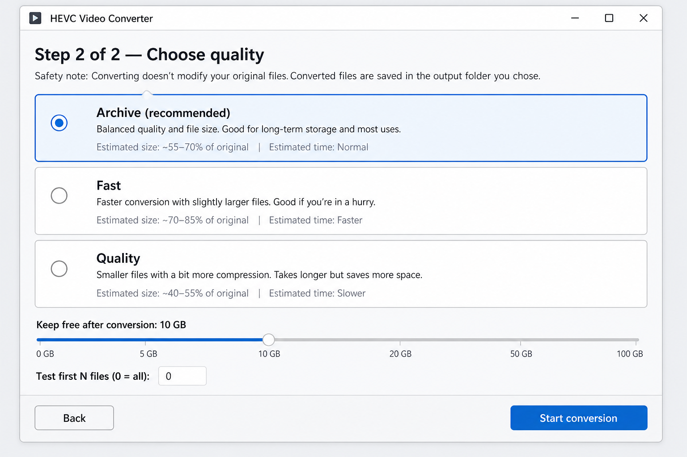

# H.265 (HEVC) Batch Media Transcoder

Shrink a personal video library to H.265/HEVC without touching the originals — pick two folders and convert with a GUI wizard, or use the CLI overnight.

[](https://github.com/lucas-albers-lz4/transcode/actions/workflows/test.yml)
[](LICENSE.md)

**Why try it**

- **Never modifies source files** — output goes only to a separate destination folder
- **Resume-safe** — cancel anytime; already-converted HEVC outputs are skipped on the next run
- **Skips files already in HEVC** — no wasted re-encodes
- **Estimate before you commit** — size and time previews for Archive, Fast, and Quality profiles
- **Hardware when it helps** — Archive auto-picks NVENC / VideoToolbox or software `libx265` per file



## Download (recommended)

1. Install **FFmpeg 6.x–9.x** once (not bundled):

```bash
# macOS
brew install ffmpeg

# Ubuntu/Debian
sudo apt install ffmpeg

# Fedora
sudo dnf install ffmpeg

# Windows
winget install ffmpeg
```

2. Download the latest build from the [Releases page](https://github.com/lucas-albers-lz4/transcode/releases), extract it, and run:

```bash
./transcode_gui/transcode_gui          # macOS / Linux
transcode_gui\transcode_gui.exe        # Windows
```

See `INSTALL.txt` in the zip for platform notes. On macOS unsigned builds: right-click → Open (Gatekeeper). If the app says FFmpeg is missing after install, open a new terminal and confirm `ffmpeg -version` — see the [FAQ](FAQ.md).

**Common questions:** [Why is my output bigger?](FAQ.md#why-is-my-output-file-bigger-than-the-input) · [FFmpeg installed but app says missing](FAQ.md#the-app-says-ffmpeg-is-missing--i-just-installed-it) · [Which FFmpeg versions?](FAQ.md#which-ffmpeg-versions-are-supported)

## Or use the CLI

```bash
git clone https://github.com/lucas-albers-lz4/transcode.git
cd transcode
uv venv && source .venv/bin/activate
uv pip install -r requirements.txt

./convert_to_h265.py /path/to/source /path/to/destination
```

Full options, profiles, and examples: [user guide](docs/user-guide.md).

## Requirements

- FFmpeg 6.x–9.x on PATH (`libx265`; optional `hevc_nvenc` / `hevc_videotoolbox`)
- For the GUI from source: Python 3.8+ and `requirements-gui.txt`
- Enough free disk space for the destination copies

## Documentation

| Document | Audience | Contents |
|----------|----------|----------|
| [User guide](docs/user-guide.md) | End users | Full CLI reference, GUI walkthrough, profiles, examples |
| [FAQ](FAQ.md) | All users | Common questions and troubleshooting |
| [Building](docs/building.md) | Developers | PyInstaller build, packaging, cross-platform notes |
| [Contributing](CONTRIBUTING.md) | Contributors | Architecture, dev setup, linting, testing |
| [Development guide](docs/DEVELOPMENT.md) | Developers | Architecture deep-dive, design decisions, linting reference |

## License

MIT — see [LICENSE.md](LICENSE.md).
